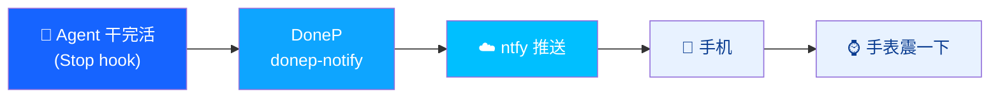
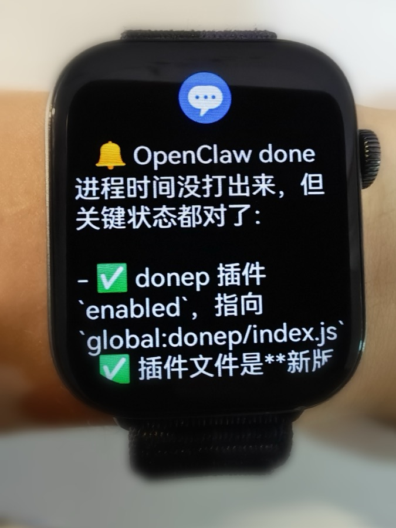

<p align="center">
  
</p>

<h1 align="center">DoneP 🔔</h1>

<p align="center"><b>AI agent 干完活，震你一下。无需任何新 AI 硬件，随时随地知道它跑完没、结果如何。</b></p>

---

你挂着 Claude Code / Codex 跑长任务，却得时不时回去瞄一眼它停了没？
DoneP 让 agent **干完一轮停下等你**的那一刻，把通知推到你手机/手表上 —— 你大可去喝咖啡、开会、遛弯，它好了自然叫你。



> 关键点：**用你已有的手机/手表就行**，不用买灵动岛配件、不用新 AI 设备。

<p align="center">
  
</p>
<p align="center"><i>Agent 跑完任务的那一刻，叮一下 —— 抬腕就看到结果（含它最后回复的内容）。</i></p>

## 用起来（3 步）

1. **手机装 [ntfy](https://github.com/binwiederhier/ntfy-android/releases)**，订阅 DoneP 给你的 topic
   （国内务必用 F-Droid/GitHub 版并开启「Instant delivery / 及时交付」，Play 版走 FCM 收不到）
2. **打开 DoneP**，菜单栏点铃铛 → topic 已自动生成好，点「测试」确认手机收到
3. **给想提醒的 Agent 拨开开关** —— 完事

| 内置支持 | 接入方式 | 通知带回复内容 |
|---|---|---|
| Claude Code（含 antcc） | `~/.claude/settings.json` 的 `Stop` hook | ✅ 完整回复 |
| Codex | `~/.codex/hooks.json` 的 `Stop` hook | ✅ 完整回复 |
| OpenClaw | 原生插件（`agent_end` 事件）| ✅ 完整回复 |

> Claude / Codex：DoneP 只把 `donep-notify` 安全注入/移除到各 Agent 的 `Stop` 钩子，**保留你已有的其它钩子**并自动备份 `*.bak-donep-*`。结束钩子 = 整轮结束停下等输入那一刻，不会过程中狂震。改完钩子需**新开一个会话**才生效（hook 在会话启动时快照）。
>
> OpenClaw：开启开关时 DoneP 自动装插件到 `~/.openclaw/extensions/donep/` 并写好配置，需 `openclaw restart` 一次让 gateway 加载插件。
>
> 通知正文 = Agent 最后一条回复全文（不截断，手表/手机端自己截断显示）。

### 接入你自己的 Agent（Agent 时代玩法）

不需要 DoneP 源码。把 DoneP 面板上显示的 skill 路径（`~/.donep/skill/SKILL.md`）发给你的 AI，让它读完自动接入。约定很简单：

- **注册**：往 `~/.donep/agents/<id>.json` 写 `{ "name": "MyBot" }`，DoneP 面板自动出现开关（目录监听，零轮询）。
- **通知**：干完活时调 `'~/Library/Application Support/DoneP/donep-notify' --agent 'MyBot'`（或再跟标题/正文自定义）。你不需要知道 ntfy 地址。
- **卸载**（可选）：注册文件里写 `uninstall` 命令，用户在面板关开关时 DoneP 代为清理。

## 安装

下载 [Release](../../releases) 里的 DMG，拖进 Applications。未公证，首次**右键 → 打开**，或「系统设置 → 隐私与安全性」点「仍要打开」。

## 隐私

全部本地运行，不收集任何数据。topic 靠"名字猜不到"保证私密，首次已自动生成带随机串的专属名。想更稳可自建 ntfy 服务器，地址填进 DoneP 即可。

## 构建

```bash
./scripts/build-app.sh 0.8.0   # 编译 + 组装 DoneP.app
./scripts/make-dmg.sh 0.8.0    # 打包 DMG
```

## ☕ 请我喝咖啡

DoneP 永久免费开源。如果它帮你少盯了几次屏幕，欢迎扫码请杯咖啡 🙏（App 里也有按钮）


## License

MIT
